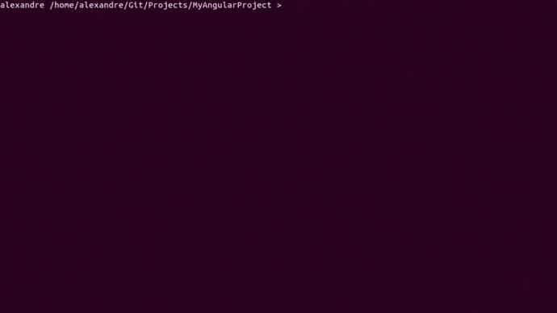
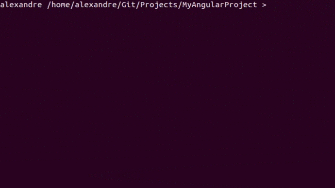

# MyLinter-angular

**Automatic corrector of several 'ng lint' errors' list**

# Installation

```bash
git clone --depth=1 https://github.com/Mitix-EPI/MyLinter-angular &&
cd MyLinter-angular && sudo ./installer
```

# How to use

**(Terminal): In angular project with ng lint rule**



```bash
    my_linter
```
*You must have nodeJS and npm*
*Also, have the @angular-devkit package updated (at least like in the example)*
```json
// package.json

"devDependencies": {
    "@angular-devkit/build-angular": "~0.1000.0"
```

# Automatic Check Updates




